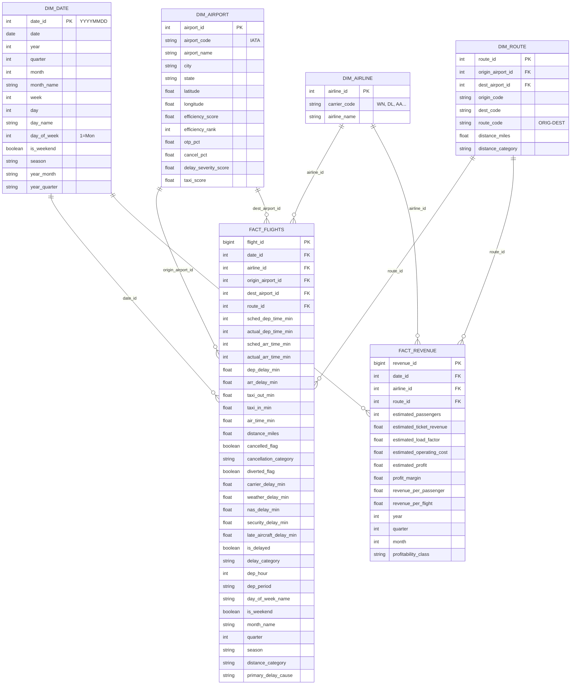

# Airline Operations and Revenue Analytics Platform

An end-to-end data engineering and business intelligence platform designed to process, clean, and model large-scale aviation datasets. The platform builds a robust star-schema data warehouse optimized for Power BI reporting, enabling deep operational analysis (delays, cancellations, efficiency) and modeled financial/revenue forecasting.

---

## Table of Contents
1. Project Overview
2. Data Architecture and Star Schema
3. Project Directory Structure
4. Tech Stack and Dependencies
5. Data Sources
6. ETL Pipeline Workflow
7. Installation and Setup
8. Execution Guide
9. Data Validation and Quality Assurance
10. Power BI Integration
11. Assumptions and Methodology

---

## 1. Project Overview
The Airline Operations and Revenue Analytics Platform integrates three primary datasets from the United States Bureau of Transportation Statistics (BTS) and Kaggle to analyze aviation operations. Key goals include:
- **Operational Intelligence**: Identify trends in flight delays, taxi times, cancellations, and primary delay causes.
- **Revenue Modeling**: Estimate ticket revenue, operating costs, load factors, and route profitability using historical ticket samples and segment census data.
- **Airport Benchmarking**: Score and rank airports based on operational efficiency (OTP, cancellation rates, taxi times).
- **Analytical Enhancements**: Route categorization (2x2 matrix of high/low revenue and profit) and seasonal trend analysis.

---

## 2. Data Architecture and Star Schema
The repository shapes the processed data into a classical dimensional star schema, optimized for high-performance analytical queries and Power BI's semantic layer.



### Dimension Tables
- **DIM_DATE**: High-granularity date table spanning a continuous calendar year (2024). Includes time-intelligence attributes such as day of week, weekend indicator, month, quarter, and season.
- **DIM_AIRLINE**: Maps standard 2-character operating carrier codes (e.g., AA, DL, WN) to full carrier names.
- **DIM_AIRPORT**: Combines BTS master coordinate data with operational logs to provide geographical context (latitude/longitude, city, state) and pre-calculated composite efficiency scores.
- **DIM_ROUTE**: Maps directional Origin-Destination airport pairs, tracking median distance and haul categories (Short, Medium, Long, Ultra-Long Haul).

### Fact Tables
- **FACT_FLIGHTS**: High-granularity operational log containing details for each individual flight, including scheduled/actual timings, taxi durations, delay components (carrier, weather, NAS, security, late aircraft), and status flags (delayed, cancelled, diverted).
- **FACT_REVENUE**: Mid-granularity modeled financial ledger aggregated by carrier, route, and month. Establishes load factors, ticket revenues, operating costs, and estimated profitability.

---

## 3. Project Directory Structure
Here is the organization of the codebase:
```
airline-operations-revenue-analytics/
├── data/
│   ├── raw/                      # Raw CSV/ZIP source files (Git ignored)
│   └── processed/                # Processed output Parquet files (including staging)
├── docs/                         # Detailed system design documents
│   ├── assumptions.md            # Explanation of modeling assumptions
│   ├── data_model.md             # Star schema and column mappings
│   ├── etl_design.md             # Detailed pipeline architectural layout
│   └── t100_download_guide.md    # Guide for downloading T-100 datasets
├── logs/                         # Execution logs
├── notebooks/                    # Interactive Jupyter notebooks for analysis (empty/available)
├── outputs/                      # Figures, charts, and processed output exports
├── powerbi/                      # Power BI resources
│   ├── dax_measures.md           # Ready-to-copy DAX measure definitions
│   ├── model_diagram.md          # ERD model diagram documentation
│   ├── quickstart.md             # Step-by-step Power BI setup guide
│   └── template_spec.md          # Design specifications for dashboards
├── reports/                      # Auto-generated reports
│   ├── data_quality_report.md    # Report on cleaned rows, column conversions, etc.
│   └── validation_report.md      # Auto-run validation check summaries
├── scripts/                      # Auxiliary helper and download scripts
│   ├── download_db1b.py          # Script to download DB1B market/coupon datasets
│   ├── download_t100.py          # Script to fetch monthly T-100 zip files
│   └── debug_selenium.py         # Selenium driver debug script
├── src/                          # Core source code modules
│   ├── config.py                 # Centralized configuration, paths, and mapping lookups
│   ├── data_cleaning.py          # Cleaning procedures for raw operational and DB1B data
│   ├── data_loader.py            # File loading and chunked processors using DuckDB
│   ├── feature_engineering.py    # Dimension generation, facts building, and score metrics
│   ├── etl_pipeline.py           # Main orchestration driver script
│   ├── utils.py                  # Logger setups, timers, progress bar trackers
│   └── validation.py             # Validation framework suite
├── requirements.txt              # Project dependency manifest
├── final_summary.py              # Summary validation script
└── fix_data_integrity.py         # Data integrity utility
```

---

## 4. Tech Stack and Dependencies
The project uses the following major libraries:
- **Core Data Engineering**: Python, Pandas (v2.2+), Polars (v1.5+), Numpy
- **Database & Query Execution**: DuckDB (v1.0+) for high-speed local analytical queries and Parquet generation
- **Web Automation**: Selenium (v4.15+) for automated BTS dataset downloads
- **Data Validation**: Great Expectations (v0.18+) concepts mapped to a custom validation script
- **Visualization (Optional)**: Matplotlib, Seaborn, Plotly

---

## 5. Data Sources
The platform relies on the following primary datasets:
1. **BTS On-Time Performance (Kaggle)**: Contains operational logs (delay reasons, cancellation details) for ~7 million US domestic flights.
2. **BTS DB1B Market**: A 10% sample of all airline passenger tickets, containing itinerary fares, passenger counts, and distances.
3. **BTS T-100 Segment**: A 100% census database of actual carrier operations, tracking seats, departures, and passenger loads on each flight route.
4. **Static Reference Files**: Master Coordinate data for airport longitude/latitude matching and Carrier Lookup files.

---

## 6. ETL Pipeline Workflow
The pipeline runs in six sequentially ordered phases:
1. **Phase 1: Extract & Clean**:
   - Load raw CSV/ZIP files.
   - Clean data: validate dates, convert time columns (hhmm format) to minutes since midnight, set delays of cancelled flights to 0, cap extreme delays, drop negative-distance rows, remove duplicates.
   - Filter DB1B fares according to standard academic ranges ($20 to $9998) and exclude bulk fares.
   - Generate `reports/data_quality_report.md`.
2. **Phase 2: Build Dimensions**:
   - Assemble `DIM_DATE`, `DIM_AIRLINE`, `DIM_AIRPORT`, and `DIM_ROUTE`.
   - Calculate airport operational efficiency scores and ranks.
3. **Phase 3: Build Facts**:
   - Build `FACT_FLIGHTS` by mapping operational logs to dimensional surrogate keys.
   - Combine DB1B market and T-100 segment records on carrier, route, and month/quarter coordinates.
   - Multiply DB1B passenger metrics by 10 to scale the 10% sample to represent 100% of flight operations.
   - Calculate modeled passenger counts, ticket revenue, load factor, operating costs, and profitability.
4. **Phase 4: Enhancements**:
   - Apply analytical enhancements: 2x2 profitability classifications ("High Revenue / High Profit", etc.).
5. **Phase 5: Validation**:
   - Execute the validation suite (referential integrity, pk/fk unique checks, boundary range validations).
   - Generate `reports/validation_report.md`.
6. **Phase 6: Save Outputs**:
   - Export structured staging and dimensional parquet files to `data/processed/`.

---

## 7. Installation and Setup
### System Prerequisites
- Python 3.10+
- Google Chrome browser (for automated T-100 downloads)
- Chrome WebDriver matching your browser version

### Step-by-Step Installation
1. Clone the repository:
   ```bash
   git clone https://github.com/broskifoo/airline_operations.git
   cd airline_operations
   ```
2. Set up a virtual environment:
   ```bash
   python -m venv .venv
   # On Windows:
   .venv\Scripts\activate
   # On macOS/Linux:
   source .venv/bin/activate
   ```
3. Install dependencies:
   ```bash
   pip install -r requirements.txt
   ```

---

## 8. Execution Guide
The pipeline is managed via the orchestration entry point `src/etl_pipeline.py`.

### A. Full Data Rebuild
Runs the end-to-end ETL processing and outputs Parquet tables:
```bash
python src/etl_pipeline.py --full
```

### B. Sample Run (Testing)
Runs the pipeline on sample data (`flight_data_2024_sample.csv`) to test configuration and script behavior:
```bash
python src/etl_pipeline.py --sample
```

### C. Incremental Loading
Loads a new month of operational flight logs. Requires specifying target year and month (1-12):
```bash
python src/etl_pipeline.py --incremental --year 2024 --month 7
```

### D. Validate Data Only
Skips processing and runs the validation rules on already processed parquet files:
```bash
python src/etl_pipeline.py --validate-only
```

### E. Automated T-100 Download
To download T-100 segment data automatically via Selenium:
```bash
python scripts/download_t100.py --year 2024 --output-dir data/raw --headless
```

---

## 9. Data Validation and Quality Assurance
At the end of each run, the pipeline runs a suite of 33 tests across dimensions and fact tables. A run will output warnings if checks fail, writing results to `reports/validation_report.md`.

Core checks include:
- **Primary Key Uniqueness**: Verifies all dimensions and facts contain distinct surrogate keys.
- **Referential Integrity**: Assures all foreign keys in `FACT_FLIGHTS` and `FACT_REVENUE` exist in parent dimensions.
- **Date Sequence Continuity**: Confirms no days are missing in the calendar dimension.
- **Logical Consistency**: Checks that cancelled flights contain zero delays and that delays fit within boundaries (maximum 1440 minutes/24 hours).
- **Mathematical Feasibility**: Verifies distances and revenues are non-negative, and profit margins fall within [-100%, 100%].

---

## 10. Power BI Integration
This database star-schema is ready to be loaded into Power BI Desktop.

### Setup Instructions
1. **Get Data**: Connect to the `data/processed/` folder. Load all dimension `.parquet` files and `fact_revenue.parquet`.
2. **Partitioned Fact Table**: Import `fact_flights.parquet/` using the **Folder Connector** to load all monthly partitions.
3. **Establish Relationships**:
   - Bind dimensions to fact foreign keys (1-to-many, single direction filtering from Dimension to Fact).
   - Configure active relationships between `dim_airport[airport_id]` and both `fact_flights[origin_airport_id]` and `fact_flights[dest_airport_id]`.
4. **Configure Calendars**: Select `dim_date`, click **Mark as Date Table**, and select the `date` column to enable Power BI Time Intelligence.
5. **Hide Keys**: Hide all surrogate primary/foreign key columns from report view to keep the model clean.
6. **Create DAX Measures**: Refer to `powerbi/dax_measures.md` to load measures (OTP %, Flight counts, load factors, and What-If operating cost adjustments).

---

## 11. Assumptions and Methodology
To prevent misinterpretation of analytical readouts, keep in mind these modeling rules:
- **Modeled Labeling**: All metrics derived from calculations (such as ticket revenue, load factor, and profit) are explicitly prefixed with "Estimated" or "Modeled" and must not be treated as actual carrier financial records.
- **10% Sample Scaling**: DB1B ticket passenger counts and itinerary fares are scaled by a factor of 10 to estimate full market size.
- **Operating Cost Model**: Available Seat Mile (ASM) operating cost is modeled at a baseline CASM of $0.12 (adjustable dynamically in Power BI using What-If parameters).
- **Truncated Fares**: Fares below $20 or above $9998 are excluded from DB1B calculations to prevent pricing outliers from skewing average yield measurements.
