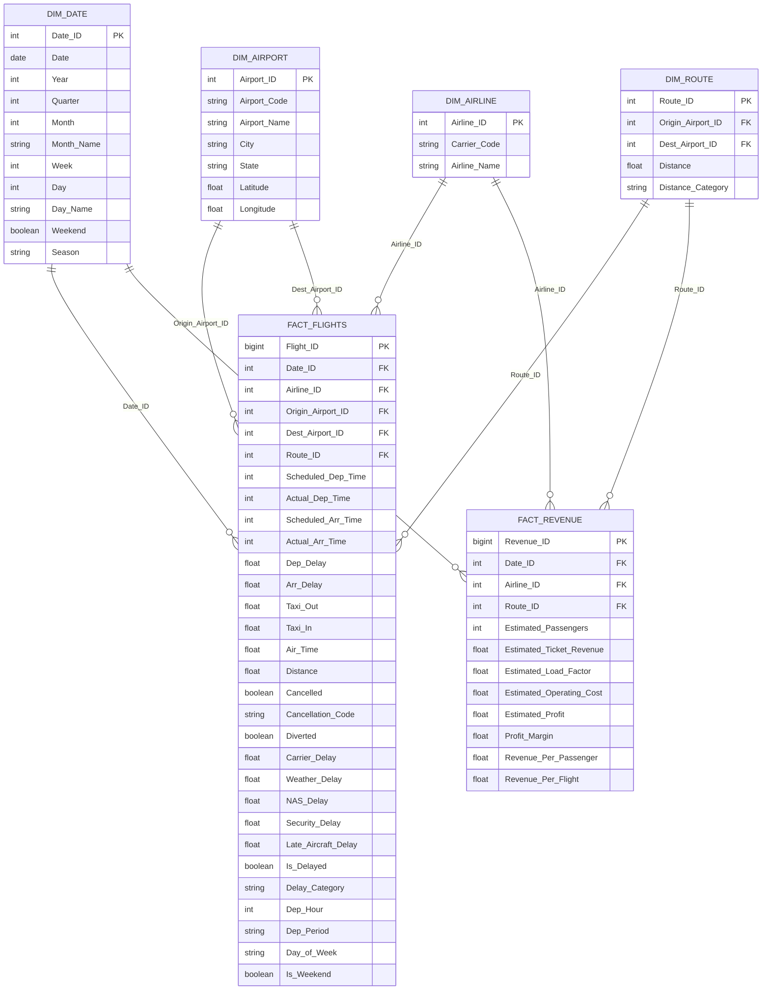

# Data Model Documentation
## Airline Operations & Revenue Intelligence Platform

---

## Star Schema Overview



---

## Primary Keys & Foreign Keys

| Table | Primary Key | Foreign Keys |
|-------|-------------|--------------|
| DIM_DATE | Date_ID | — |
| DIM_AIRLINE | Airline_ID | — |
| DIM_AIRPORT | Airport_ID | — |
| DIM_ROUTE | Route_ID | Origin_Airport_ID → DIM_AIRPORT, Dest_Airport_ID → DIM_AIRPORT |
| FACT_FLIGHTS | Flight_ID | Date_ID → DIM_DATE, Airline_ID → DIM_AIRLINE, Origin_Airport_ID → DIM_AIRPORT, Dest_Airport_ID → DIM_AIRPORT, Route_ID → DIM_ROUTE |
| FACT_REVENUE | Revenue_ID | Date_ID → DIM_DATE, Airline_ID → DIM_AIRLINE, Route_ID → DIM_ROUTE |

---

## Relationships & Cardinality

| From | To | Cardinality | Filter Direction | Rationale |
|------|-----|-------------|------------------|-----------|
| DIM_DATE | FACT_FLIGHTS | 1:* | Single (Date → Fact) | Standard date dimension |
| DIM_AIRLINE | FACT_FLIGHTS | 1:* | Single (Airline → Fact) | Filter flights by airline |
| DIM_AIRPORT | FACT_FLIGHTS (Origin) | 1:* | Single (Airport → Fact) | Filter by origin airport |
| DIM_AIRPORT | FACT_FLIGHTS (Dest) | 1:* | Single (Airport → Fact) | Filter by destination airport |
| DIM_ROUTE | FACT_FLIGHTS | 1:* | Single (Route → Fact) | Filter by route |
| DIM_DATE | FACT_REVENUE | 1:* | Single (Date → Fact) | Revenue by month/quarter |
| DIM_AIRLINE | FACT_REVENUE | 1:* | Single (Airline → Fact) | Revenue by airline |
| DIM_ROUTE | FACT_REVENUE | 1:* | Single (Route → Fact) | Revenue by route |

> **Note**: No many-to-many relationships. All dimensions filter facts in single direction.

---

## Dimension Details

### DIM_DATE
- **Granularity**: Day
- **Range**: 2024-01-01 to 2024-12-31 (extendable)
- **Date_ID**: YYYYMMDD integer (e.g., 20240115)
- **Season Mapping**: Spring (Mar-May), Summer (Jun-Aug), Fall (Sep-Nov), Winter (Dec-Feb)

### DIM_AIRLINE
- **Source**: BTS On-Time `op_unique_carrier` + BTS Master Coordinate carrier lookup
- **Rows**: ~15 major carriers (2024)
- **Carrier Codes**: WN, DL, AA, UA, OO, NK, MQ, B6, AS, F9, OH, YX, OH, EV, 9E, G4, HA

### DIM_AIRPORT
- **Source**: BTS On-Time `origin`/`dest` + BTS Master Coordinate table
- **Rows**: ~350 US airports
- **Fields**: Airport_Code (IATA), Airport_Name, City, State, Lat, Lon

### DIM_ROUTE
- **Granularity**: Origin-Destination pair (directional)
- **Source**: Unique Origin-Dest combinations from FACT_FLIGHTS
- **Distance_Category**: Short (<500), Medium (500-1500), Long (1500-3000), Ultra (>3000)
- **Rows**: ~5,000-10,000

---

## Fact Table Details

### FACT_FLIGHTS (Operational)
- **Granularity**: One row per flight (Marketing Carrier On-Time Performance)
- **Rows**: ~7M (2024 full year)
- **Key Metrics**:
  - Dep_Delay, Arr_Delay (minutes, negative = early)
  - Cancelled (0/1), Cancellation_Code (A/B/C/D)
  - Diverted (0/1)
  - Delay causes: Carrier, Weather, NAS, Security, Late_Aircraft (minutes)
  - Taxi_Out, Taxi_In, Air_Time (minutes)
- **Derived Columns**:
  - Is_Delayed: Arr_Delay >= 15
  - Delay_Category: On-Time / Minor (15-45) / Moderate (45-90) / Severe (90+)
  - Dep_Hour: Scheduled departure hour (0-23)
  - Dep_Period: Early Morning (5-7), Morning (8-11), Afternoon (12-16), Evening (17-20), Night (21-4)

### FACT_REVENUE (Modeled/Estimated)
- **Granularity**: Carrier-Route-Month (from DB1B 10% sample × 10)
- **Rows**: ~500K (2024)
- **Source**: DB1B Market (fare, passengers) + T-100 (seats, departures)
- **Estimation Methodology**:
  - Estimated_Passengers = DB1B_Passengers × 10 (10% sample scaling)
  - Estimated_Ticket_Revenue = DB1B_MktFare × DB1B_Passengers × 10
  - Estimated_Load_Factor = T100_Passengers / T100_Seats
  - Estimated_Operating_Cost = T100_Seats × Distance × CASM ($0.12/ASM assumed)
  - Estimated_Profit = Estimated_Ticket_Revenue - Estimated_Operating_Cost
- **Labels**: All columns prefixed with `Estimated_` or `Modeled_`

---

## ETL Data Flow

```
Raw Data (CSV)
    │
    ▼
Staging Layer (DuckDB/Parquet)
    │
    ├──→ Clean & Validate
    │       │
    │       ├── DIM_DATE (generated)
    │       ├── DIM_AIRLINE (from carrier lookup)
    │       ├── DIM_AIRPORT (from BTS Master Coordinate)
    │       ├── DIM_ROUTE (from fact distinct Origin-Dest)
    │       │
    │       └──→ FACT_FLIGHTS (cleaned on-time data)
    │
    └──→ Revenue Modeling
            │
            ├── DB1B Market (fare, passengers) × 10
            ├── DB1B Coupon (cabin class, segment detail)
            ├── T-100 Segment (seats, departures, load factor)
            │
            └──→ FACT_REVENUE (modeled estimates)
```

---

## Data Quality Rules

| Rule | Table | Action |
|------|-------|--------|
| Cancelled flights have null actual times | FACT_FLIGHTS | Keep; set Dep_Delay=Arr_Delay=0; flag Cancelled=1 |
| Negative distance | FACT_FLIGHTS | Drop row (impossible) |
| Delay > 1440 min | FACT_FLIGHTS | Cap at 1440; flag outlier |
| Invalid airport code (not 3-char) | FACT_FLIGHTS/DIM_AIRPORT | Cross-ref BTS Master; drop unknown |
| Duplicate flight key (Date+Carrier+FlightNum+Origin+Dest) | FACT_FLIGHTS | Keep first; log count |
| Time format hhmm → minutes | FACT_FLIGHTS | Vectorized conversion; 2400→0 |
| DB1B 10% sample scaling | FACT_REVENUE | Multiply Passengers & Revenue × 10; label "Estimated" |
| CASM assumption | FACT_REVENUE | $0.12/ASM industry avg; label "Modeled" |

---

## Power BI Model Notes

- **Date Table**: Mark as Date Table in Power BI for time intelligence
- **Relationships**: All Single direction (dimension → fact)
- **Hidden Columns**: Surrogate keys (Date_ID, Airline_ID, etc.) hidden from report view
- **Measures**: All DAX measures in `powerbi/dax_measures.md`
- **Calculation Groups**: Consider for time intelligence (YoY, MoM, YTD, MTD)