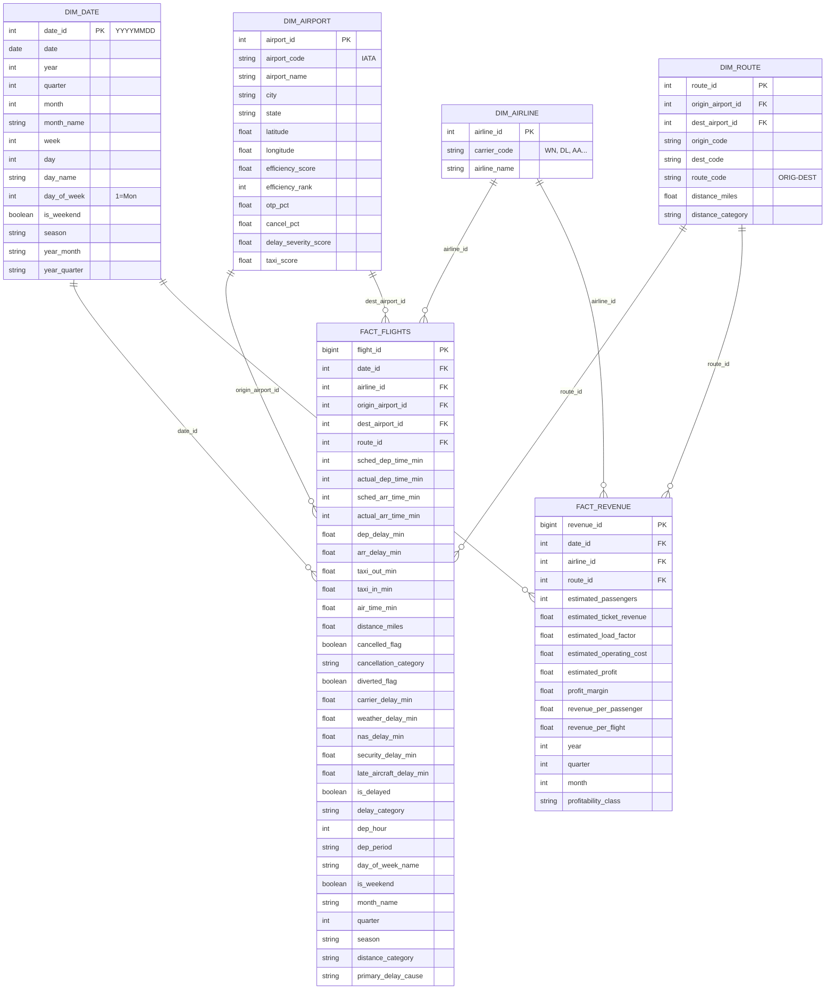

# Power BI Data Model
## Airline Operations & Revenue Intelligence Platform

---
> **Star Schema**: All relationships are Single direction (Dimension → Fact)
> **Date Table**: dim_date marked as Date Table for Time Intelligence

---

## Model Diagram (Mermaid)



---

## Relationship Details

| From (Dimension) | To (Fact) | Column | Cardinality | Filter Direction |
|------------------|-----------|--------|-------------|------------------|
| DIM_DATE | FACT_FLIGHTS | date_id | 1:* | Single (Dim → Fact) |
| DIM_AIRLINE | FACT_FLIGHTS | airline_id | 1:* | Single (Dim → Fact) |
| DIM_AIRPORT | FACT_FLIGHTS (Origin) | origin_airport_id | 1:* | Single (Dim → Fact) |
| DIM_AIRPORT | FACT_FLIGHTS (Dest) | dest_airport_id | 1:* | Single (Dim → Fact) |
| DIM_ROUTE | FACT_FLIGHTS | route_id | 1:* | Single (Dim → Fact) |
| DIM_DATE | FACT_REVENUE | date_id | 1:* | Single (Dim → Fact) |
| DIM_AIRLINE | FACT_REVENUE | airline_id | 1:* | Single (Dim → Fact) |
| DIM_ROUTE | FACT_REVENUE | route_id | 1:* | Single (Dim → Fact) |

---

## Hidden Columns (Not visible in report view)

| Table | Hidden Columns |
|-------|----------------|
| DIM_DATE | date_id, year_quarter, year_start, quarter_start, month_start |
| DIM_AIRLINE | airline_id |
| DIM_AIRPORT | airport_id, latitude, longitude, efficiency_rank, delay_severity_score, taxi_score, cancel_pct |
| DIM_ROUTE | route_id, origin_airport_id, dest_airport_id |
| FACT_FLIGHTS | flight_id, date_id, airline_id, origin_airport_id, dest_airport_id, route_id |
| FACT_REVENUE | revenue_id, date_id, airline_id, route_id |

---

## Calculated Columns (Pre-built in ETL)

### DIM_AIRPORT
- `efficiency_score` - Weighted composite (OTP 40%, Cancellation 25%, Delay 20%, Taxi 15%)
- `efficiency_rank` - Rank by efficiency_score (1 = best)
- `otp_pct` - On-Time Performance %
- `cancel_pct` - Non-cancellation %
- `delay_severity_score` - Normalized delay severity
- `taxi_score` - Normalized taxi performance

### FACT_REVENUE
- `profitability_class` - 2×2 matrix: "High Revenue / High Profit", "High Revenue / Low Profit", "Low Revenue / High Profit", "Low Revenue / Low Profit"
- All revenue columns prefixed with `estimated_` or `modeled_`

### FACT_FLIGHTS
- `delay_category` - "On-Time", "Minor (15-45)", "Moderate (45-90)", "Severe (90+)"
- `dep_period` - "Early Morning", "Morning", "Afternoon", "Evening", "Night"
- `distance_category` - "Short Haul", "Medium Haul", "Long Haul", "Ultra Long Haul"
- `primary_delay_cause` - "Carrier", "Weather", "NAS", "Security", "Late Aircraft", "On-Time"
- `is_delayed` - Boolean (arr_delay >= 15)

---

## Recommended Visuals by Table

### DIM_DATE (Time Intelligence)
- Calendar hierarchy: Year → Quarter → Month → Week → Day
- Mark as Date Table → date column
- Enable: Year, Quarter, Month, Week, Day hierarchies

### DIM_AIRLINE
- Slicer: carrier_code (WN, DL, AA, UA, OO, NK, B6, AS, F9, etc.)
- Search enabled for carrier lookup

### DIM_AIRPORT
- Map visual: latitude/longitude for airport locations
- Slicer: airport_code, city, state
- Search enabled

### DIM_ROUTE
- Slicer: route_code (e.g., "LAX-JFK"), origin_code, dest_code
- Distance category filter

### FACT_FLIGHTS (Operational)
- Large fact table (7M rows) - use DirectQuery or aggregations
- Partitioned by date_id for performance
- Key metrics: delays, cancellations, diversions, taxi times

### FACT_REVENUE (Modeled Revenue)
- Smaller fact table (29K rows) - Import mode fine
- All metrics labeled "Estimated" in visuals
- Profitability classification for 2×2 matrix

---

## Performance Recommendations

1. **FACT_FLIGHTS**: Use aggregations for large dataset
   - Create aggregation table at carrier-route-month level
   - Set detail rows to fact_flights
   - Enable "Show detail rows" for drill-through

2. **FACT_REVENUE**: Import mode (29K rows is small)

3. **DIM_AIRPORT**: Use for map visuals with lat/long

4. **DIM_DATE**: Mark as Date Table for time intelligence

5. **Relationships**: All Single direction, no bi-directional

6. **Measures**: Use calculation groups for time intelligence (YoY, MoM, YTD, MTD)

---

## What-If Parameters

| Parameter | Table | Min | Max | Default | Increment |
|-----------|-------|-----|-----|---------|-----------|
| CASM | CASM_WhatIf | 0.08 | 0.15 | 0.12 | 0.01 |

Usage in measures:
```dax
Estimated Operating Cost (What-If) = 
SUMX(
    fact_revenue,
    fact_revenue[total_seats_t100] * fact_revenue[avg_distance_t100] * CASM_WhatIf[CASM_WhatIf Value]
)
```

---

## Data Labels Convention

| Prefix | Meaning | Display Name Example |
|--------|---------|---------------------|
| (none) | Observed/Actual | "Arrival Delay" |
| `Estimated ` | Scaled from sample | "Estimated Ticket Revenue (Modeled)" |
| `Modeled ` | Derived via formula | "Modeled Operating Cost" |

All revenue visuals must include "(Modeled)" or "(Estimated)" in titles.